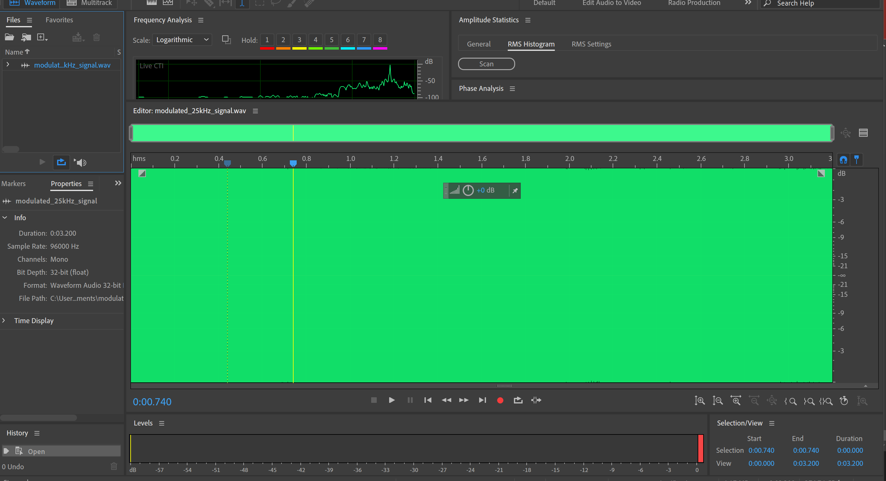
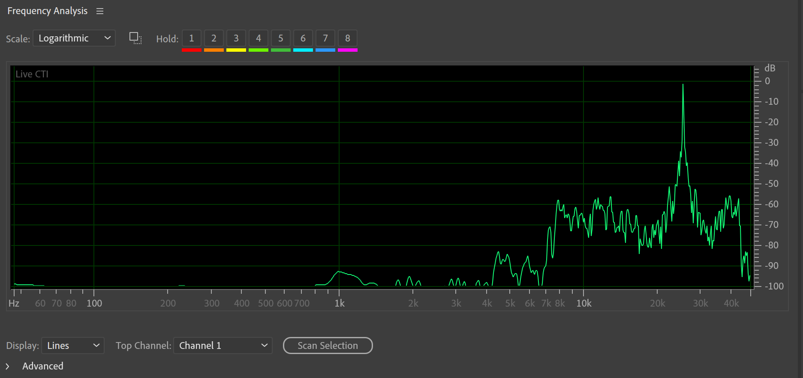
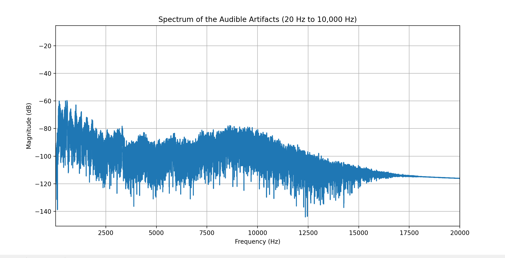

# UltraDolphin


## Overview

UltraDolphin is a Python-based project designed to process audio signals, modulate them into ultrasonic frequencies, and then demodulate them back into audible signals with introduced artifacts. This project showcases techniques in audio signal processing, including amplitude modulation, non-linear distortion, and filtering.

## Features

- **Audio Resampling:** Automatically checks and resamples the input audio to the desired sample rate.
- **Ultrasonic Modulation:** Modulates audio signals to a high-frequency ultrasonic carrier.
- **Non-linear Distortion:** Applies non-linear transformations to simulate microphone distortions.





- **Audible Artifact Extraction:** Filters the non-linear signal to extract audible artifacts.



- **Spectrum Analysis:** Plots the frequency spectrum of various stages of the signal processing.

## Installation

To set up the project, follow these steps:

1. **Clone the repository:**

   ```sh
   git clone https://github.com/yourusername/UltraDolphin.git
   cd UltraDolphin
   ```

2. **Set up a virtual environment:**

   ```sh
   python -m venv venv
   source venv/bin/activate  # On Windows use `venv\Scripts\activate`
   ```

3. **Install the required packages:**

   ```sh
   pip install -r requirements.txt
   ```

## Execution Guide

1. **Run the script:**

   ```sh
   python ultradolphin.py
   ```

2. **Input the path to your audio file when prompted:**

   ```sh
   Enter the path to the audio file: path/to/your/audiofile.wav
   ```

3. **The script will process the audio and generate the following files:**

   - `audible_artifacts.wav`: Contains the audible artifacts extracted from the ultrasonic signal.
   - `modulated_25kHz_signal.wav`: Contains the modulated ultrasonic signal.

4. **The script will also plot the frequency spectrum of various stages of the signal processing.**

## How It Works

1. **Audio Input and Resampling:**
   - The script prompts the user to input an audio file.
   - It checks the sample rate of the input audio and resamples it if necessary to the desired sample rate (96 kHz).

2. **Ultrasonic Modulation:**
   - The normalized audio signal is modulated onto a 25 kHz ultrasonic carrier using amplitude modulation (AM).

3. **Non-linear Distortion:**
   - The modulated signal is passed through a non-linear transformation to simulate distortions commonly introduced by microphones.

4. **Audible Artifact Extraction:**
   - The distorted signal is filtered using a low-pass filter to extract the audible range (20 Hz to 10 kHz).

5. **Spectrum Analysis:**
   - The frequency spectrum of the original modulated signal, the non-linear distorted signal, and the audible artifacts are plotted for analysis.

## Dependencies

- `numpy`
- `matplotlib`
- `scipy`
- `pydub`

## Contributing

Contributions are welcome! Please fork the repository and submit a pull request with your changes.

## License

This project is licensed under the MIT License.

## Contact

For any inquiries or feedback, please contact [your email].

